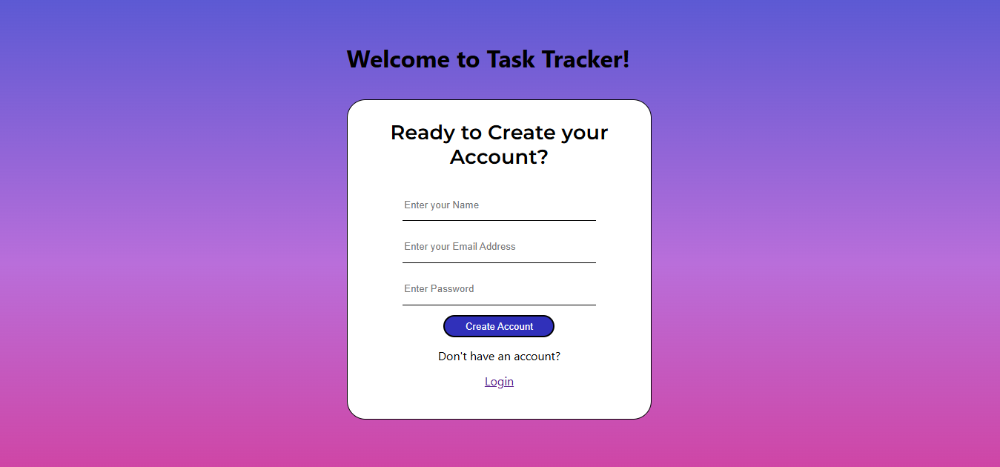
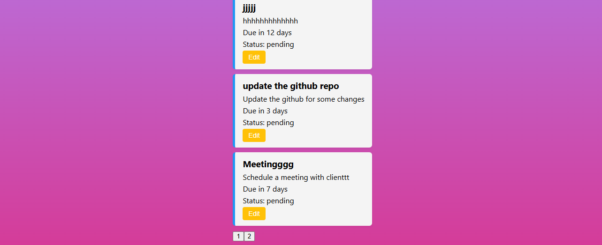

# 📝 Task Tracker App

A **MERN Stack-based Task Tracker** web application designed to help users manage their daily tasks efficiently. This app allows users to register, login, add tasks, update them, delete tasks, and track overdue ones. Tasks are categorized by status and include due dates for productivity tracking.

---

## 📌 Features

- User Authentication (Register/Login)
- Add, Edit, Delete tasks
- View all tasks or filter by overdue
- Tasks have a title, description, due date, and status
- Responsive and visually appealing UI
- Protected routes for authorized users
- Error handling and user feedback

---

## 🌟 Bonus Features Implemented

The following optional features were implemented to enhance the application:

- ✅ **Pagination** for task list with intuitive navigation
- ✅ **Logout button** with proper session clearing

---

## 🛠️ Technologies Used

### Frontend:
- React.js
- Axios
- React Router
- CSS (with gradient backgrounds and card layouts)

### Backend:
- Node.js
- Express.js
- MongoDB (via Mongoose)
- JSON Web Tokens (JWT) for authentication
- bcrypt for password hashing

---

## Repository Structure 

task-tracker/
├── backend/                  
│   ├── config/               # Database connection and jwt setup
│   ├── controllers/          # Route handler logic
│   ├── middlewares/          # Custom middlewares (e.g. error handling, auth)
│   ├── models/               # Mongoose models
│   ├── routes/               # API route definitions
│   ├── utils/                # Utility functions
│   ├── .env                  # Environment variables (not pushed to GitHub)
│   ├── server.js             # Entry point of backend
│   └── package.json          # Backend dependencies
│
├── frontend/                 # React frontend
│   ├── public/               # Public assets
│   ├── src/
│   │   ├── components/       # Reusable components
│   │   ├── pages/            # Page-level components
│   │   ├── App.js            # Main app component
│   │   └── index.js          # React entry point
│   └── package.json          # Frontend dependencies
│
├── .gitignore                # Ignored files/folders
├── README.md                 # Project documentation


## 🚀 Getting Started

Follow the steps below to run the application locally:

### ✅ Prerequisites

- Node.js and npm installed
- MongoDB installed and running locally or connected via cloud (MongoDB Atlas)

---

### 🔧 Backend Setup

```bash
cd backend
npm install

- Create a .env file in the backend directory:
- Add the following code and use your specific connection string and jwt secret key.

PORT=5000
MONGO_URI=your_mongodb_connection_string
JWT_SECRET=your_jwt_secret_key
Start backend server:

- Run the following command in terminal
```bash
node server.js

---

### Frontend Setup
```bash
cd frontend
npm install
npm start

---

## User Flow
- Register a new user from signup

- Login via login

- Redirected to your Task Dashboard

- Create tasks with title, description, due date

- Tasks appears; you can edit, delete or mark them

- Logout via the top button


## 🖼️ Application Screenshots

### 🔹 Homepage


### 🔹 Login Page


### 🔹 Tasks Dashboard


### 🔹 Task List with Pagination



